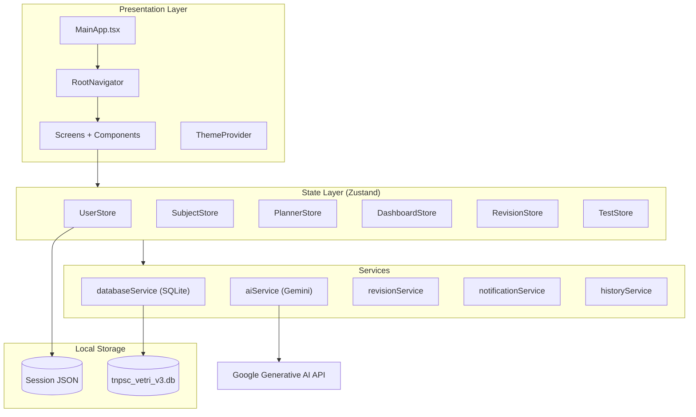

# Vetri TNPSC — Application Documentation

**Version:** 1.0.0  
**Package:** `com.vetri.tnpsc`  
**Platform:** Android (primary), iOS, Web (Expo)

---

## 1. Overview

**Vetri TNPSC** is a mobile study companion for aspirants preparing for the Tamil Nadu Public Service Commission (TNPSC) examinations. The app helps users plan daily study, track topics and subjects, follow spaced-revision schedules, log mock-test scores, and generate practice questions using Google Gemini AI—all stored locally on the device with no mandatory cloud account.

The name *Vetri* (வெற்றி) reflects the goal of exam success. The product is built as a cross-platform **React Native** app using **Expo SDK 54**.

---

## 2. Target Users

- TNPSC aspirants targeting **Group 1**, **Group 2**, **Group 4**, or **VAO** posts
- Students who want offline-first planning, revision reminders, and progress analytics
- Bilingual learners (English and Tamil UI)

---

## 3. Core Features

### 3.1 Onboarding & Profile

- Three-step onboarding: choose exam goal → set name and daily study hours → confirm
- Local registration (name + default password stored in SQLite)
- Profile screen: edit name, view exam target, toggle **dark mode**, **Tamil/English** language, notifications, and reset all app data

### 3.2 Dashboard

- Personalized greeting and exam countdown (e.g. Group 4 target date)
- **Today’s schedule** with status workflow: Pending → In Progress → Completed / Next Up
- Add, reschedule, or delete schedule items for the current day
- **Analytics tab** with charts (study time, progress trends via `AnalyticsView`)
- Quick stats: study streak, hours studied today vs daily goal, pending tasks
- Links to start study sessions and view revisions due today
- Topic reshuffle for overdue planner items

### 3.3 Study Planner

Two main areas in the Planner screen:

| Tab | Purpose |
|-----|---------|
| **Subjects & Topics** | Create subjects, add topics, mark complete, delete topics/subjects |
| **Weekly Schedule** | Week strip navigation, time-blocked schedule items linked to topics, revisions, or mock tests |

Shared UI components live in `PlannerShared.tsx` (schedule cards, modals, week strip, circular progress, status metadata).

### 3.4 Spaced Revision System

When a topic is completed via a study session, the app schedules **three revisions** at **7, 15, and 30 days** (spaced repetition).

- **Revision Dashboard** lists today’s due revisions and overdue count
- Users can mark revisions complete or **reshuffle** overdue items (if more than five overdue, they are spread across the next three days)
- Revision study opens the same **Study Session** flow in revision mode

### 3.5 Study Session (Pomodoro-style)

- Focus timer (default 25 minutes, or topic-specific allocated time)
- 5-minute break between sessions with optional auto-start
- On completion: saves duration to `StudySessions`, updates topic status, schedules revisions when applicable
- Haptic feedback on session end

### 3.6 Mock Tests & Progress Tracking

- Log scores by standard TNPSC-style subjects (General Studies, Tamil, Aptitude, Current Affairs, Science & Technology) with preset max marks totaling 200
- **Weak areas** tracking based on repeated low performance
- Test history with performance badges (Excellent / Good / Keep Trying)
- **AI Mock Test**: generate MCQs from a topic (and optional text resources or uploaded image) via Gemini; take the quiz in-app and review explanations

### 3.7 Notifications

- Permission setup on launch
- Daily study reminders (configurable from profile)
- Fallback reminder if the user has been inactive

### 3.8 Localization

- **English (`en`)** and **Tamil (`ta`)** via `i18next` and `react-i18next`
- Device locale detection through `expo-localization`
- Language toggle on Profile screen

---

## 4. Architecture



### Design principles

- **Offline-first:** All study data persists in SQLite on device
- **Unidirectional flow:** Screens call Zustand stores; stores call `databaseService` and other services
- **Session persistence:** Logged-in user ID stored in AsyncStorage; restored on app start
- **Minimal backend:** Only external dependency is Google Gemini for AI features (requires network)

---

## 5. Technology Stack

| Layer | Technology |
|-------|------------|
| Framework | React Native 0.81, React 19 |
| Tooling | Expo ~54, TypeScript 5.9 |
| Navigation | React Navigation 7 (native stack + bottom tabs) |
| Styling | NativeWind 4 + Tailwind CSS 3 |
| State | Zustand 5 |
| Database | expo-sqlite 16 (WAL mode, foreign keys) |
| Persistence (session) | @react-native-async-storage/async-storage |
| AI | @google/generative-ai (model: `gemini-2.5-flash-lite`) |
| i18n | i18next, react-i18next, expo-localization |
| Charts | react-native-chart-kit, react-native-svg |
| Icons | lucide-react-native |
| Dates | date-fns |
| Build | EAS Build (`eas.json`) |

---

## 6. Data Model (SQLite)

Database file: `tnpsc_vetri_v3.db`

| Table | Description |
|-------|-------------|
| `Users` | Name, password, exam target, daily study hours |
| `Subjects` | Per-user subjects with color and weightage |
| `Topics` | Belongs to subject; status PENDING / IN_PROGRESS / COMPLETED; optional `scheduledDate` |
| `Revisions` | Spaced revision entries per topic (revision number, date, status) |
| `StudySessions` | Duration logged per topic per day |
| `MockTests` | Overall test score and max score per user |
| `TestBreakdown` | Per-subject scores within a mock test |
| `WeakAreas` | Aggregated weak subjects per user |
| `Exams` | User-defined exam milestones |
| `ScheduleItems` | Daily/time-blocked planner entries with type TOPIC / REVISION / MOCK_TEST / OTHER |

Migrations run incrementally inside `initDatabase()` (e.g. adding `scheduledDate`, `topicId`, `startedAt`, `completedAt` columns).

---

## 7. Navigation Structure

```
Root Stack
├── Onboarding (if not logged in)
└── Main (Bottom Tabs) — if logged in
    ├── Dashboard
    ├── Planner
    ├── Revisions (RevisionDashboard)
    ├── Tests (MockTests)
    └── Profile
    ├── StudySession (modal stack screen)
    └── AIQuestionGenerator (stack screen)
```

---

## 8. Project Structure

```
tnpsc-vetri/
├── MainApp.tsx              # App entry: DB init, notifications, navigation shell
├── index.ts                 # Expo registerRootComponent
├── app.json                 # Expo config (Android package, plugins)
├── eas.json                 # EAS build profiles (preview APK, production)
├── global.css               # NativeWind global styles
├── tailwind.config.cjs
├── babel.config.cjs
├── metro.config.cjs
└── src/
    ├── components/
    │   ├── AnalyticsView.tsx
    │   └── PlannerShared.tsx
    ├── config/
    │   └── index.ts         # AI model and API key (should use env in production)
    ├── context/
    │   └── ThemeProvider.tsx
    ├── hooks/
    │   └── useStudyTimer.ts
    ├── localization/
    │   └── i18n.ts          # en + ta translations
    ├── navigation/
    │   └── RootNavigator.tsx
    ├── screens/
    │   ├── Onboarding.tsx
    │   ├── Dashboard.tsx
    │   ├── Planner.tsx
    │   ├── RevisionDashboard.tsx
    │   ├── MockTests.tsx
    │   ├── Profile.tsx
    │   ├── StudySession.tsx
    │   ├── AIQuestionGenerator.tsx
    │   └── Progress.tsx
    ├── services/
    │   ├── databaseService.ts
    │   ├── aiService.ts
    │   ├── revisionService.ts
    │   ├── notificationService.ts
    │   └── historyService.ts
    └── store/
        ├── index.ts
        └── slices/          # user, subject, planner, dashboard, revision, test
```

---

## 9. Key Services

### `databaseService.ts`

Central data access: schema creation, migrations, CRUD for users, subjects, topics, revisions, study sessions, mock tests, schedule items, and dashboard aggregations (streak, hours, today’s topics).

### `aiService.ts`

- `generateMockTestQuestions(topic, resources?, count?, image?)` — Returns JSON array of MCQs with options, correct answer, and explanation
- `translateEvents(...)` — Translates historical timeline events for bilingual history features

### `revisionService.ts`

- `scheduleRevisions(topicId)` — Inserts 7/15/30-day revision rows
- `getRevisionsDueToday()` — Joins revisions with topic titles
- `reshuffleOverdueRevisions()` — Redistributes backlog when overdue count > 5

### `notificationService.ts`

Permission handling, Android notification channel, daily study reminders, and fallback inactive-user reminders.

---

## 10. State Management (Zustand Slices)

| Store | Responsibility |
|-------|----------------|
| `userStore` | Auth, session restore, profile updates, account reset |
| `subjectStore` | Subjects, topics, completion, reshuffle |
| `plannerStore` | Schedule items by date, CRUD, status toggles |
| `dashboardStore` | Today’s metrics, streak, study hours, loading |
| `revisionStore` | Due/overdue revisions, mark complete, reshuffle |
| `testStore` | Mock test save/load, weak areas, history |

---

## 11. Configuration

AI settings are defined in `src/config/index.ts`:

- `GOOGLE_AI_API_KEY` — Required for AI mock tests and translations
- `GEN_AI_MODEL` — Default: `gemini-2.5-flash-lite`

**Security recommendation:** Move the API key to environment variables (e.g. `EXPO_PUBLIC_GOOGLE_AI_API_KEY`) and never commit secrets to version control. Rotate any key that has been exposed in source.

---

## 12. Build & Deployment

### Development

```bash
npm install
npm start          # Expo dev server
npm run android    # Android emulator/device
npm run ios        # iOS simulator/device
npm run web        # Web preview
```

### Android APK (EAS)

```bash
npm install -g eas-cli
eas login
eas build:configure
eas build -p android --profile preview
```

The `preview` profile in `eas.json` produces an **APK** (`buildType: apk`) suitable for sideloading and testing.

---

## 13. User Flow Summary

1. **First launch** → Onboarding → Local user created → Main tabs
2. **Planner** → Add subjects/topics → Schedule time blocks on weekly view
3. **Dashboard** → See today’s plan → Start study session from a topic or schedule item
4. **Study session** → Timer runs → Topic marked complete → Revisions auto-scheduled
5. **Revisions tab** → Complete due revisions on schedule
6. **Tests tab** → Log manual mock scores or launch **AI Mock Test**
7. **Profile** → Adjust language, theme, notifications; reset data if needed

---

## 14. Dependencies on Device Capabilities

| Capability | Expo module | Used for |
|------------|-------------|----------|
| SQLite | expo-sqlite | All app data |
| Notifications | expo-notifications | Study reminders |
| Localization | expo-localization | Default language |
| Haptics | expo-haptics | Session completion feedback |
| Document picker | expo-document-picker | AI test resource upload |
| Image picker | expo-image-picker | Scan notes for AI question context |

---

## 15. Known Limitations & Future Considerations

- Authentication is local-only (name + simple password); no cloud sync or multi-device backup
- AI features require internet and a valid Gemini API key
- Exam countdown on Dashboard uses a hardcoded target date (configurable per exam target in a future release)
- Web build is supported by Expo but the app is optimized for mobile study workflows
- Progress screen exists in the codebase but is not wired into the main tab navigator in the current `RootNavigator`

---

## 16. Related Files

| File | Notes |
|------|-------|
| `readme.txt` | Short EAS build command reference |
| `vetri_tnpsc_tech_spec.docx.pdf` | Original technical specification (if present in repo) |

---

## 17. Summary

Vetri TNPSC is an **offline-capable TNPSC study planner** combining structured scheduling, spaced revision, mock-test analytics, and AI-generated practice questions. Its architecture keeps user data on-device in SQLite while using Zustand for reactive UI state and Google Gemini only for optional AI-assisted learning features.

For questions about extending the app, start with `MainApp.tsx` (bootstrap), `RootNavigator.tsx` (routing), and `databaseService.ts` (data layer).
